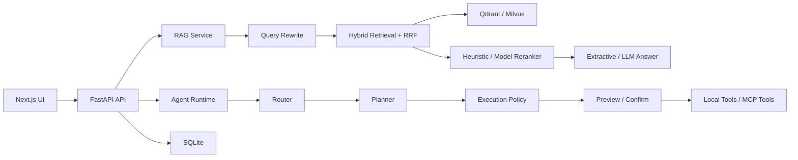

# Enterprise RAG Agent

一个可本地运行、可扩展到真实模型与企业工具的 RAG + Agent 应用原型。项目默认使用离线组件，不配置 API Key 也能完成文档入库、混合检索、引用回答、Agent 审批执行和 SSE 流式交互。

GitHub: https://github.com/jnnn33/enterprise-rag-agent

## 核心功能

- 文档知识库：支持 JSON、TXT、Markdown、PDF、DOCX 上传，完成解析、切块、向量化和持久化。
- 企业 RAG：关键词 + 向量召回、RRF 融合、Query Rewrite、二阶段 Rerank、Answer + Citations + Trace。
- 可切换基础设施：Qdrant / Milvus，离线 Hash / OpenAI-compatible Embedding，规则 / HTTP Reranker，抽取式 / OpenAI-compatible LLM。
- Agent Runtime：Router、Planner、Skill、Tool、Execution Policy、Preview、Confirm、Execute、Retry 和审计事件。
- 风险审批：工具分为 `read`、`write`、`external`，写入和外部调用默认必须人工确认。
- 业务 Skill：知识问答、招聘评估、工作项状态更新、MCP 工具调用。
- MCP：支持 stdio 与 Streamable HTTP 工具发现和调用，附本地 FastMCP 演示服务器。
- 实时交互：聊天与 Agent 执行均提供 SSE；聊天流包含状态、证据、token 和完成事件。
- 质量验证：RAG 评测 API、SQLite 数据持久化、后端自动化测试、Next.js 生产构建。

## 架构



## 本地运行

后端：

```powershell
python -m venv .venv
.\.venv\Scripts\python.exe -m pip install -e ".[dev]"
.\.venv\Scripts\python.exe -m uvicorn app.main:app --app-dir backend --host 127.0.0.1 --port 8000
```

前端：

```powershell
cd frontend
npm.cmd install
npm.cmd run dev
```

打开：

- 应用：http://127.0.0.1:3000
- API 文档：http://127.0.0.1:8000/docs
- Provider 状态：http://127.0.0.1:8000/api/v1/providers

## 可选集成

安装 MCP 和 Milvus 适配器：

```powershell
.\.venv\Scripts\python.exe -m pip install -e ".[dev,mcp,milvus]"
```

默认配置见 [.env.example](.env.example)，完整配置与演示命令见 [docs/RUNBOOK.md](docs/RUNBOOK.md)。未配置外部模型时，项目使用 Hash Embedding、Heuristic Reranker 和 Extractive Answer，功能可用但语言理解能力有限。

## 验证

```powershell
.\.venv\Scripts\python.exe -m pytest -q
cd frontend
npm.cmd run build
```

## 学习路线

项目代码可以先完成，课程仍按零基础节奏逐层讲解。44 课时路线见 [docs/COURSE_ROADMAP.md](docs/COURSE_ROADMAP.md)。